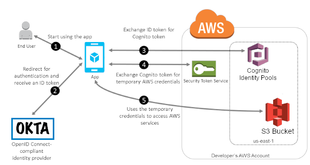
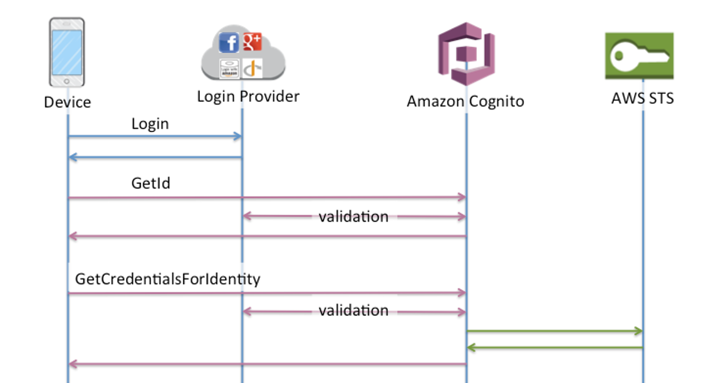

# Amplify Okta Expo Demo

This solution demonstrates how a user can integrate the Amplify frontend library, Cognito and Okta into a React Native built using the Expo framework to achieve the following:
-	Authenticate users through an external OIDC Identity Provider – in this case Okta
-	Empower the mobile application to make calls through Amplify to an API or the AWS SDK
-	Allow fine grained access to individual resources

To demonstrate the desired functionality, we will modify a blank React Native project to login to your Okta application and make an AWS SDK call from the app to list the items inside an S3 bucket. 

Here is a visual representation of the architecture we just discussed, for a further deep dive into this diagram, please check out the blog that accompanies this sample.


Here is what the final application will look like:


Here is a diagram to show you the nature of the calls that will be happening:

# Contact the Author
If you get stuck or find something has become broken please submit an issue with a detailed description and we will get back to you when possible

# Infrastructure

All the files in the `infra` folder will be used to set up the minimum infrasctructure for this demo. This infrastructure is tasked with linking your pre-existing OIDC provider with AWS IAM. It will also create an S3 bucket for the purposes of demonstrating a functional Expo app that makes use of authenticated Amplify API calls.

This guide assumes you have a basic understanding of CDK and AWS.

## Building this Infrastructure

Pre-Requisites:

We must configure the values of our Okta App to be able to successfully create the IAM OIDC provider. To do this use the file okta-config-example.ts to create a new file called okta-config.ts the file will look like this:

export const OktaConfig = {
    url : "https://dev-xxxxxxxxx.okta.com",
    client_id : "xxxxxxxxxxxxxx"
};

Replace the values with your Okta domain name and the Client ID of your Okta App. Afterwards, if this is your first time running CDK  you must run the following command:


```
cdk bootstrap
```

```
cd infra
npm install
cdk deploy
```

# Unit Tests

This repo includes Jest unit tests to ensure that the CDK template contains the expected number of resources and that they are configured correctly.

```
cd infra
npm run test
```

# Expo Application

This demonstation does not cover how to deploy an Expo application for download onto mobile devices. These instructions allow for the creation of a development environment to validate the solution proposed in the original blog post.

This guide assumes a basic familiarity with Expo React Native development.

## Running a Development Server

Pre-Requisites
- Android or IOS simulator instalation
- - IOS simulators will require an Apple device
- Expo instalation and configuration

```
npm install
expo start
```

Depending on your computers networking setup you may need to use a `Local` connection instead of `Tunnel` or `LAN`. To do so press `d` on your keyboard to bring up the developer tools in your browser.

Press `a` or `i` to start your Android or iOS simulator respectively. 

## Expo Adendums

To further customize your OIDC solution replace the scheme in the `app.json` file.

```
    "scheme": "rnoidctest"
```